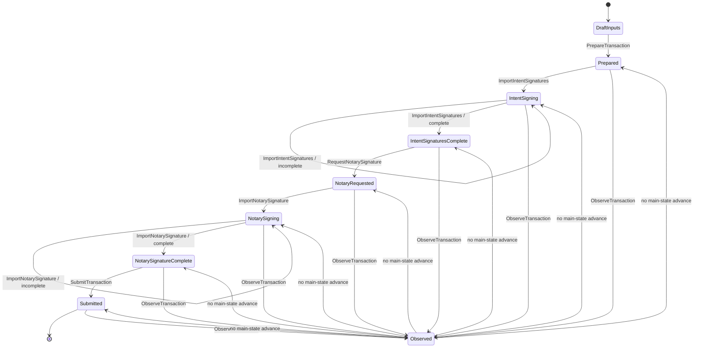
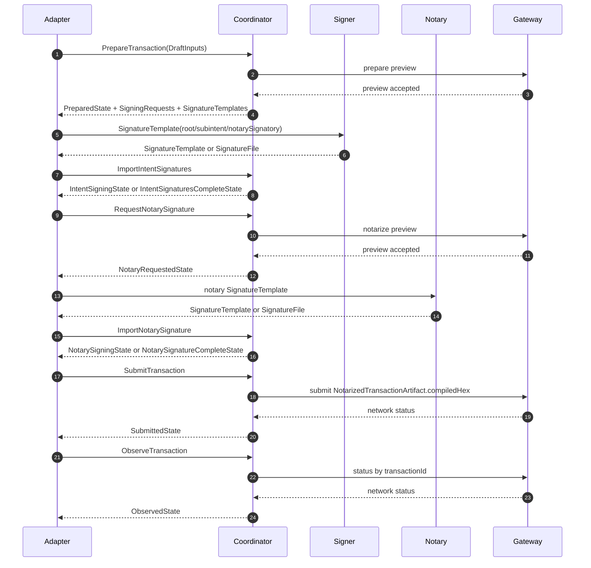
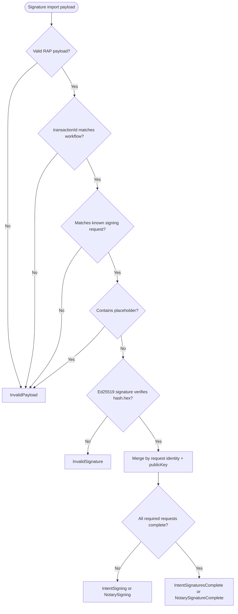
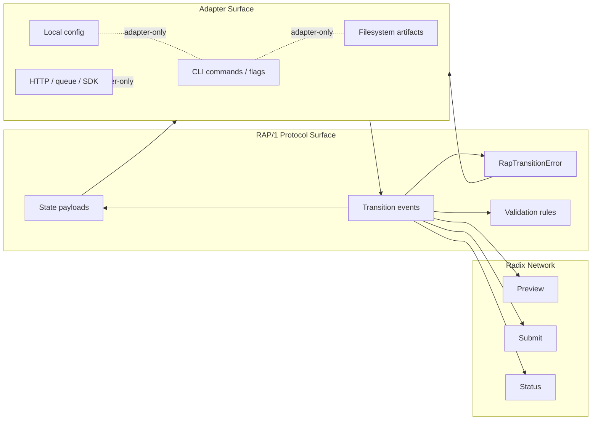

# Radix Agent Protocol (RAP/1)

Status: Draft  
Version: 1  
Stability: Current implementation draft, not a final external standard  
Audience: Agent implementers, transaction coordinators, signer adapters, and CLI/API adapter authors

## Abstract

Radix Agent Protocol version 1 (RAP/1) specifies a finite-state protocol for coordinating Radix Transaction Manifest V2 workflows between agents, signers, notaries, and a Radix network.

RAP/1 defines the protocol states, JSON payload shapes, transition events, validation rules, and error shapes required to move a transaction workflow from draft transaction inputs to prepared transaction state, out-of-band signatures, notarization, submission, and network status observation.

RAP/1 is not a CLI command format. A CLI, HTTP API, filesystem workflow, queue worker, or in-process SDK MAY implement RAP/1 as an adapter.

## 1. Terminology And Normative Language

The key words `MUST`, `MUST NOT`, `REQUIRED`, `SHOULD`, `SHOULD NOT`, and `MAY` are to be interpreted as normative protocol language.

**Coordinator**: The system component that advances a RAP workflow through state transitions.

**Signer**: An external participant that receives a signing request and returns a signature produced outside the coordinator.

**Notary**: The signer responsible for producing the final notary signature over the signed transaction intent.

**Adapter**: An implementation-specific surface over RAP, such as a CLI, HTTP endpoint, local file store, queue consumer, or library API.

**Workflow**: One RAP transaction state machine instance identified by a `transactionId` after preparation.

**TransactionId**: RAP's workflow correlation ID after preparation. In RAP/1 this is the Radix intent hash identifier used for Gateway status.

## 2. Scope

RAP/1 covers:

- Radix Transaction Manifest V2 workflows.
- One root transaction intent.
- Direct child subintents.
- Ed25519 public keys and signatures.
- Out-of-band signing.
- JSON-compatible payloads with camelCase field names.
- Network-bound transaction workflow state.

RAP/1 does not cover:

- Consumer wallet UX.
- Private key custody.
- Browser wallet pairing.
- Hardware wallet protocols.
- Arbitrary message signing.
- General account indexing or portfolio APIs.
- CLI command names, flags, or filesystem paths.

## 3. Conformance

A RAP/1 implementation MUST implement the state machine and transition validation rules in this document.

An adapter MAY expose RAP/1 through any transport or storage model. Adapter-specific command names, file paths, config formats, logs, and help text are not RAP/1 protocol surface.

Every public RAP/1 payload MUST include `type` and `version` when a concrete payload type defines those fields.

```ts
type RapVersion = 1;

type RapTypedPayload = {
  type: string;
  version: RapVersion;
};
```

Diagrams in this document are informative. If a diagram conflicts with normative text, the normative text wins.

## 4. Protocol States

The main RAP/1 transaction workflow is linear:

```text
DraftInputs
  -> Prepared
  -> IntentSigning
  -> IntentSignaturesComplete
  -> NotaryRequested
  -> NotarySigning
  -> NotarySignatureComplete
  -> Submitted
```

Network status observation is an overlay. Observation MUST NOT advance the main signing, notarization, or submission state.

| State | Meaning | May Be Derived |
| --- | --- | --- |
| `DraftInputs` | Transaction inputs exist, but no canonical transaction ID exists. | No |
| `Prepared` | Transaction ID, intent, analysis, and signing requests exist. | No |
| `IntentSigning` | Intent/subintent signatures are being collected. | Yes |
| `IntentSignaturesComplete` | All pre-notary signing requests are satisfied. | Yes |
| `NotaryRequested` | Signed intent has been built and notary signing request exists. | No |
| `NotarySigning` | Notary signature is being collected. | Yes |
| `NotarySignatureComplete` | All signing requests, including notary, are satisfied. | Yes |
| `Submitted` | A notarized transaction payload has been submitted and recorded. | No |
| `Observed` | Gateway status has been observed without advancing the main workflow. | Yes |

Adapters MAY derive the derived states from canonical signature state rather than persisting separate state payloads.

### 4.1 State Diagram



## 5. Common Types

```ts
type Network = "mainnet" | "stokenet";

type TransactionId = string;

type HexString = string;

type PublicKey = {
  curve: "Ed25519";
  hex: HexString; // 64 hex characters
};

type SignatureValue = {
  curve: "Ed25519";
  hex: HexString; // 128 hex characters
};

type Hash = {
  id: string;
  hex: HexString;
};

type SubintentId = string; // ^[A-Za-z][A-Za-z0-9_-]{0,63}$

type SigningScope =
  | { kind: "rootIntent" }
  | { kind: "subintent"; subintentId: SubintentId }
  | { kind: "notarySignatory" }
  | { kind: "notary" };
```

`Hash.id` MUST be non-null in RAP/1. Adapter fallback behavior for missing hash IDs is outside valid protocol state.

`SubintentId` values MUST match `^[A-Za-z][A-Za-z0-9_-]{0,63}$`.

## 6. DraftInputs

`DraftInputs` is the only state without a `transactionId`.

```ts
type DraftInputsState = {
  state: "DraftInputs";
  network: Network;
  rootManifest: RootManifestInput;
  subintents?: SubintentsInput;
  notary: NotaryInput;
};

type RootManifestInput = {
  kind: "rootManifest";
  sourceName?: string;
  rtm: string;
};

type SubintentsInput = {
  type: "subintents";
  version: 1;
  subintents: Record<
    SubintentId,
    {
      manifest: string;
    }
  >;
};

type NotaryInput = {
  type: "notary";
  version: 1;
  publicKey: PublicKey;
  notaryIsSignatory?: boolean;
};
```

Requirements:

- `network` MUST be selected before preparation and MUST NOT change after preparation.
- `notaryIsSignatory` defaults to `true`.
- `rootManifest.rtm` and each subintent `manifest` MUST contain inline RTM text.
- File paths are adapter inputs and MUST be resolved before creating `DraftInputs`.
- A root manifest that yields to a child MUST use `YIELD_TO_CHILD NamedIntent("<subintentId>")`.
- Every yielded subintent ID MUST be present in `subintents`.
- Every provided subintent ID MUST be yielded by the root manifest.

## 7. Prepared

`Prepared` is the first canonical workflow state. It creates the `transactionId` and binds the workflow to one Radix network.

```ts
type PreparedState = {
  state: "Prepared";
  prepared: PreparedTransaction;
  transactionIntent: TransactionIntentArtifact;
  staticAnalysis: StaticAnalysisArtifact;
  signingRequests: SigningRequest[];
  signatureTemplates: SignatureTemplate[];
  copiedManifests: CopiedManifestSet;
};

type PreparedTransaction = {
  type: "preparedTransaction";
  version: 1;
  transactionId: TransactionId;
  network: Network;
  intentHash: Hash;
  subintentOrder: SubintentId[];
  notaryPublicKey: PublicKey;
  notaryIsSignatory: boolean;
};

type CopiedManifestSet = {
  rootManifest: string;
  subintents: Record<SubintentId, string>;
};
```

`PreparedTransaction.notaryPublicKey` and `PreparedTransaction.notaryIsSignatory` are REQUIRED workflow metadata even though equivalent notary data also exists in the encoded Radix transaction header.

### 7.1 Transaction Intent Artifact

```ts
type TransactionIntentArtifact = {
  type: "transactionIntent";
  version: 1;
  transactionId: TransactionId;
  encoded: {
    kind: "transactionIntentV2";
    value: TransactionIntentV2Stored;
    compiledHex: HexString;
  };
};

type TransactionIntentV2Stored = {
  transactionHeader: {
    notaryPublicKey: string;
    notaryIsSignatory: boolean;
    tipBasisPoints: number;
  };
  rootIntentCore: IntentCoreV2Stored;
  nonRootSubintents: Array<{ intentCore: IntentCoreV2Stored }>;
};

type IntentCoreV2Stored = {
  header: {
    networkId: number;
    startEpochInclusive: number;
    endEpochExclusive: number;
    minProposerTimestampInclusive?: number;
    maxProposerTimestampExclusive?: number;
    intentDiscriminator: number;
  };
  instructions: string;
  blobs: [];
  message: unknown;
  children: HexString[];
};
```

RAP/1 owns the `TransactionIntentV2Stored` shape for this draft.

### 7.2 Static Analysis Artifact

```ts
type AuthorizationAnalysis = {
  rootIntent: string[];
  subintents: Record<SubintentId, string[]>;
};

type StaticAnalysisArtifact = {
  type: "staticAnalysis";
  version: 1;
  transactionId: TransactionId;
  authorization: AuthorizationAnalysis;
  rawAnalysis?: unknown;
};
```

`StaticAnalysisArtifact.authorization` is the RAP source of truth for accounts requiring authorization. Adapters MAY store raw toolkit analysis in `rawAnalysis`.

### 7.3 Signing Requests And Templates

```ts
type SigningRequest = {
  type: "signingRequest";
  version: 1;
  transactionId: TransactionId;
  scope: SigningScope;
  account: string | null;
  hash: Hash;
};

type SignatureTemplate = {
  type: "signatureTemplate";
  version: 1;
  transactionId: TransactionId;
  scope: SigningScope;
  account: string | null;
  hash: Hash;
  publicKey: PublicKey;
  signature: SignatureValue;
};
```

`SignatureTemplate` is a protocol handoff payload for out-of-band signers. It carries the request context and provides explicit fields for the signer public key and signature.

Generated templates MAY use these placeholder values:

```text
<replace-with-ed25519-public-key-hex>
<replace-with-ed25519-signature-hex>
```

Placeholders MUST NOT appear in imported signatures.

Prepared signing requests MUST include:

- `rootIntent` requests for each root account requiring authorization.
- `subintent` requests for each direct child subintent account requiring authorization.
- `notarySignatory` request if the notary is also a transaction intent signer.

Prepared signing requests MUST NOT include `notary`. A `notary` request can only be created after intent and subintent signatures are attached.

Account invariants:

- `rootIntent` and `subintent` requests MUST have `account`.
- `notarySignatory` and `notary` requests MUST use `account: null`.

## 8. IntentSigning

```ts
type IntentSigningState = {
  state: "IntentSigning";
  prepared: PreparedTransaction;
  transactionIntent: TransactionIntentArtifact;
  signingRequests: SigningRequest[];
  signatures: SignatureFile;
  completeness: SignatureCompleteness;
};

type SignatureFile = {
  type: "signatureFile";
  version: 1;
  transactionId: TransactionId;
  signatures: SignatureEntry[];
};

type SignatureEntry = {
  scope: SigningScope;
  account: string | null;
  hash: Hash;
  publicKey: PublicKey;
  signature: SignatureValue;
};

type SignatureCompleteness = {
  required: SigningRequest[];
  complete: SigningRequest[];
  missing: SigningRequest[];
};
```

`SignatureFile` is both the canonical signature-state shape and an import payload. As transition input, `SignatureFile` is a patch: valid entries are merged into canonical signature state.

`SignatureEntry.publicKey` is the signer identity in RAP/1. Signer labels and roles are coordination metadata outside the core protocol.

Signature import requirements:

- The payload `transactionId` MUST match the workflow `transactionId`.
- Each `SignatureEntry` MUST match an existing `SigningRequest` by `transactionId`, `scope`, `account`, `hash.id`, and `hash.hex`.
- The `publicKey` and `signature` values MUST NOT contain placeholders.
- The Ed25519 signature MUST verify against `hash.hex` and `publicKey.hex`.
- Multiple signatures MAY target the same signing request identity if they use different public keys.
- Deduplication MUST use signing request identity plus public key.
- Differing duplicate signatures for the same request identity and public key MUST be ignored or rejected; adapters SHOULD surface a warning.

Multisig:

- RAP/1 supports multiple signing requests per workflow.
- RAP/1 supports multiple signatures per workflow and per signing scope.
- RAP/1 does not compute Radix authorization thresholds or exact signer sets.
- Radix manifests, static analysis, and on-ledger access rules determine authorization requirements.

## 9. IntentSignaturesComplete

```ts
type IntentSignaturesCompleteState = {
  state: "IntentSignaturesComplete";
  prepared: PreparedTransaction;
  transactionIntent: TransactionIntentArtifact;
  signatures: SignatureFile;
};
```

This state is reached when every prepared signing request has at least one matching signature. It is the protocol boundary that permits notary request generation.

Adapters MAY derive this state from signature completeness.

## 10. NotaryRequested

```ts
type NotaryRequestedState = {
  state: "NotaryRequested";
  prepared: PreparedTransaction;
  transactionIntent: TransactionIntentArtifact;
  signedTransactionIntent: SignedTransactionIntentArtifact;
  signatures: SignatureFile;
  notarySigningRequest: SigningRequest & {
    scope: { kind: "notary" };
    account: null;
  };
  notarySignatureTemplate: SignatureTemplate & {
    scope: { kind: "notary" };
    account: null;
  };
};

type SignedTransactionIntentArtifact = {
  type: "signedTransactionIntent";
  version: 1;
  transactionId: TransactionId;
  encoded: {
    kind: "signedTransactionIntentV2";
    compiledHex: HexString;
  };
};
```

The notary signing request signs the signed transaction intent hash. It MUST NOT reuse the original transaction intent hash unless those hashes are equal by Radix transaction semantics.

## 11. NotarySigning

```ts
type NotarySigningState = {
  state: "NotarySigning";
  prepared: PreparedTransaction;
  transactionIntent: TransactionIntentArtifact;
  signedTransactionIntent: SignedTransactionIntentArtifact;
  signatures: SignatureFile;
  notarySigningRequest: SigningRequest & {
    scope: { kind: "notary" };
    account: null;
  };
  completeness: SignatureCompleteness;
};
```

The signature import rules from `IntentSigning` apply. The required request set includes the `notary` request.

## 12. NotarySignatureComplete

```ts
type NotarySignatureCompleteState = {
  state: "NotarySignatureComplete";
  prepared: PreparedTransaction;
  transactionIntent: TransactionIntentArtifact;
  signedTransactionIntent: SignedTransactionIntentArtifact;
  signatures: SignatureFile;
};
```

This state is reached when every generated signing request, including the notary request, has a matching signature. It is the submit-ready protocol boundary.

Adapters MAY derive this state from signature completeness.

## 13. Submitted

```ts
type SubmittedState = {
  state: "Submitted";
  prepared: PreparedTransaction;
  notarizedTransaction: NotarizedTransactionArtifact;
  submitResult: SubmitResult;
};

type NotarizedTransactionArtifact = {
  type: "notarizedTransaction";
  version: 1;
  transactionId: TransactionId;
  compiledHex: HexString;
};

type SubmitResult = {
  type: "submitResult";
  version: 1;
  transactionId: TransactionId;
  networkStatus: NetworkTransactionStatus;
  attempts: NetworkStatusAttempt[];
};

type NetworkTransactionStatus = {
  transactionId: TransactionId;
  status: string;
  statusDescription: string;
  errorMessage: string | null;
  checkedAt: string;
};

type NetworkStatusAttempt = {
  checkedAt: string;
  status: string;
  statusDescription: string;
  errorMessage: string | null;
};
```

`Submitted` is the terminal local transaction workflow state in RAP/1. Network status can continue to change through observation overlays.

The submitted payload MUST be the compiled Notarized Transaction V2.

If a workflow has a prior `CommittedSuccess` submit result, an implementation MUST NOT submit it again.

`submitResult` is part of `Submitted` because submission produces a durable network response in the current RAP/1 flow. Later observations MAY append additional status attempts.

## 14. Observation Overlay

```ts
type ObservedState = {
  state: "Observed";
  transactionId: TransactionId;
  localWorkflow?:
    | PreparedState
    | IntentSigningState
    | IntentSignaturesCompleteState
    | NotaryRequestedState
    | NotarySigningState
    | NotarySignatureCompleteState
    | SubmittedState;
  networkStatus: NetworkTransactionStatus;
  updatedSubmitResult?: SubmitResult;
};
```

Observation requirements:

- Observation MUST be keyed by `transactionId`.
- Observation MAY occur without local workflow state.
- Observation MUST NOT advance the main workflow state.
- If local workflow state exists and the observation is not read-only, the implementation MAY append the observation to `SubmitResult.attempts`.

## 15. Transition Events

RAP/1 transition events are protocol operations. Adapters MAY expose them through commands, functions, endpoints, messages, or any other transport.

```ts
type RapTransitionEvent =
  | PrepareTransactionEvent
  | ImportIntentSignaturesEvent
  | RequestNotarySignatureEvent
  | ImportNotarySignatureEvent
  | SubmitTransactionEvent
  | ObserveTransactionEvent;

type PrepareTransactionEvent = {
  event: "PrepareTransaction";
  input: DraftInputsState;
  output: PreparedState;
};

type ImportIntentSignaturesEvent = {
  event: "ImportIntentSignatures";
  input: {
    state: PreparedState | IntentSigningState;
    signatures: SignatureTemplate | SignatureFile;
  };
  output: IntentSigningState | IntentSignaturesCompleteState;
};

type RequestNotarySignatureEvent = {
  event: "RequestNotarySignature";
  input: IntentSignaturesCompleteState;
  output: NotaryRequestedState;
};

type ImportNotarySignatureEvent = {
  event: "ImportNotarySignature";
  input: {
    state: NotaryRequestedState | NotarySigningState;
    signatures: SignatureTemplate | SignatureFile;
  };
  output: NotarySigningState | NotarySignatureCompleteState;
};

type SubmitTransactionEvent = {
  event: "SubmitTransaction";
  input: NotarySignatureCompleteState;
  output: SubmittedState;
};

type ObserveTransactionEvent = {
  event: "ObserveTransaction";
  input: {
    transactionId: TransactionId;
    localWorkflow?:
      | PreparedState
      | IntentSigningState
      | IntentSignaturesCompleteState
      | NotaryRequestedState
      | NotarySigningState
      | NotarySignatureCompleteState
      | SubmittedState;
    readOnly?: boolean;
  };
  output: ObservedState;
};
```

Transition requirements:

- `PrepareTransaction` MUST be the only transition that creates a canonical `transactionId`.
- `PrepareTransaction` MUST run the prepare preview gate before producing `PreparedState`.
- `ImportIntentSignatures` MUST NOT accept `notary` signatures before `RequestNotarySignature` has produced a `notary` signing request.
- `RequestNotarySignature` MUST fail unless the input state is `IntentSignaturesComplete`.
- `RequestNotarySignature` MUST run the notarize preview gate before producing `NotaryRequestedState`.
- `ImportNotarySignature` MUST apply the same signature validation rules as `ImportIntentSignatures`, with the `notary` request included in the required request set.
- `SubmitTransaction` MUST fail unless the input state is `NotarySignatureComplete`.
- `ObserveTransaction` MUST NOT advance the main transaction state.

`ImportIntentSignatures` and `ImportNotarySignature` are separate protocol events. They MUST NOT be collapsed by a conforming protocol surface because they represent different signing phases and different allowed request scopes.

### 15.1 Transition Sequence



### 15.2 Signature Import Decision



## 16. Preview Gates

RAP/1 has two preview gates:

| Transition | Preview Input | Signature Proof Assumption | Effect |
| --- | --- | --- | --- |
| `PrepareTransaction` | Unsigned Transaction Intent V2 preview | Assume all signature proofs | Reject invalid draft transaction state before signing requests are emitted. |
| `RequestNotarySignature` | Signed Transaction Intent V2 preview | Use real signer public keys | Reject invalid signed intent state before the notary signs. |

Preview success allows the transition to continue. Preview failure rejects the transition.

Preview receipts are not RAP/1 state artifacts and MUST NOT be required to reconstruct workflow state.

## 17. Error Model

Failed transitions return protocol errors at the RAP boundary:

```ts
type RapTransitionError =
  | {
      type: "rapError";
      code: "InvalidState";
      message: string;
      state?: string;
    }
  | {
      type: "rapError";
      code: "InvalidPayload";
      message: string;
      details?: unknown;
    }
  | {
      type: "rapError";
      code: "PreviewRejected";
      message: string;
      phase: "PrepareTransaction" | "RequestNotarySignature";
      details?: unknown;
    }
  | {
      type: "rapError";
      code: "MissingSignature";
      message: string;
      request: SigningRequest;
    }
  | {
      type: "rapError";
      code: "InvalidSignature";
      message: string;
      signature: SignatureEntry;
    }
  | {
      type: "rapError";
      code: "SubmissionRejected";
      message: string;
      transactionId: TransactionId;
      details?: unknown;
    }
  | {
      type: "rapError";
      code: "ObservationFailed";
      message: string;
      transactionId: TransactionId;
      details?: unknown;
    };
```

Adapter errors such as missing files, invalid local config, permission failures, transport failures, or command-line parsing failures are outside RAP/1 unless translated into a `RapTransitionError`.

## 18. Adapter Boundary

The current `rdx` CLI is a RAP/1 adapter. Its commands, flags, default output rendering, and artifact paths are implementation details.

Current adapter persistence mapping:

| RAP shape | Current persisted representation |
| --- | --- |
| `PreparedTransaction` | `prepared.json` |
| `TransactionIntentArtifact` | `transactionIntent.json` |
| `StaticAnalysisArtifact` | `staticAnalysis.json`; current adapter stores full toolkit analysis and derives authorization into `prepared.json` |
| `SigningRequest[]` | `signing-requests/...` |
| `SignatureTemplate[]` | `signature-templates/...` |
| `SignatureFile` | `signatures.json` |
| `SignedTransactionIntentArtifact` | `signedTransactionIntent.json` |
| `NotarizedTransactionArtifact` | `notarizedTransaction.hex` raw adapter encoding |
| `SubmitResult` | `submitResult.json` |

Current adapter-only fields include:

- `manifestSourceFile`
- `transactionIntentPath`
- `staticAnalysisPath`
- `signingRequests`
- `signatureTemplates`
- `signingRequestPath`

These fields locate JSON files on disk. They are not RAP/1 state.

The current adapter accepts a `batchSignatureFile` wrapper and expands it into repeated `SignatureFile` imports. RAP/1 core treats batching as transport ergonomics rather than a state-machine payload.

### 18.1 Adapter Boundary Diagram



## 19. Security Considerations

RAP/1 coordinators MUST NOT require or accept private keys as part of protocol state.

Signers MUST sign only the `hash.hex` value in a `SigningRequest` or `SignatureTemplate` after validating the surrounding context.

Coordinators MUST verify imported signatures locally before merging them into canonical signature state.

Coordinators MUST keep `notarySignatory` and `notary` scopes distinct. The former signs the root intent hash; the latter signs the signed transaction intent hash.

Coordinators MUST NOT submit a workflow unless all generated signing requests are complete.

Adapters SHOULD make network selection visible before preparation. A prepared workflow is network-bound and MUST NOT be reused on another network.

## 20. Document Location

This draft currently lives beside the CLI adapter because that is the only implementation. RAP/1 itself is not a CLI protocol. Once stabilized, this document SHOULD move to protocol-level documentation or a dedicated protocol package, and the CLI SHOULD be documented as one adapter.
