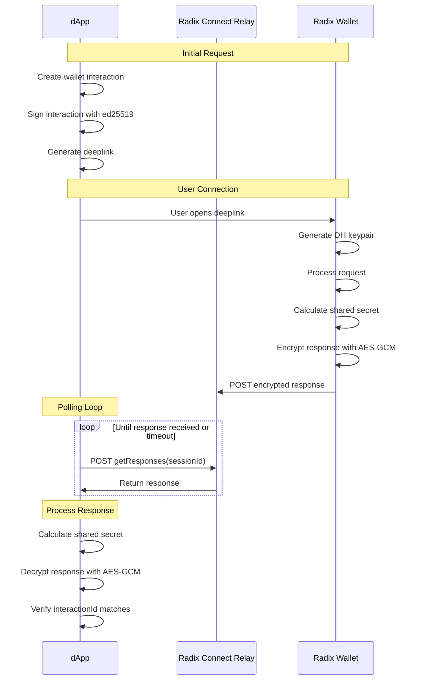

# Radix Connect

A TypeScript library for connecting dApps to the Radix Wallet.

## Installation

```bash
npm install radix-connect
```

## Usage

### Basic Example

```typescript
import {
  createRadixConnectClient,
  createRadixConnectRelayTransport,
} from 'radix-connect'

// Create transport
const transport = createRadixConnectRelayTransport({
  handleRequest: async ({ deepLink }) => {
    // Handle the deeplink (e.g. show QR code)
    console.log(deepLink)
  },
})

// Create client
const client = createRadixConnectClient({ transport })

// Send request to wallet
const response = await client.sendRequest({
  interactionId: crypto.randomUUID(),
  metadata: {
    version: 2,
    networkId: 1,
    dAppDefinitionAddress: 'account_rdx...',
    origin: 'https://your-dapp.com',
  },
  items: {
    discriminator: 'authorizedRequest',
    auth: {
      discriminator: 'loginWithChallenge',
      challenge: '...',
    },
  },
})
```

### API

#### createRadixConnectClient(options)

Creates a client instance for interacting with the Radix Wallet.

Options:

- `transport`: Transport implementation for sending requests

#### createRadixConnectRelayTransport(options)

Creates a transport client for communicating with the wallet over Radix Connect Relay.

Options:

- (optional) `baseUrl`: Relay server URL (default: https://radix-connect-relay.radixdlt.com)
- (optional) `walletUrl`: Wallet deep link URL (default: radixWallet://connect)
- (optional) `sessionId`: Custom session ID (default: random UUID)
- (optional) `privateKey`: Custom private key for Diffie-Hellman key exchange (default: randomly generated)
- `handleRequest`: Callback function to handle wallet requests

The transport uses Diffie-Hellman key exchange to establish a shared secret between the dApp and wallet. This enables end-to-end encrypted communication over the relay server.


